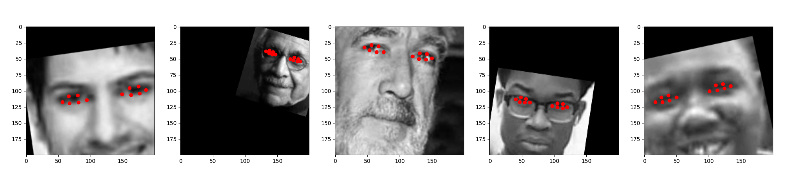
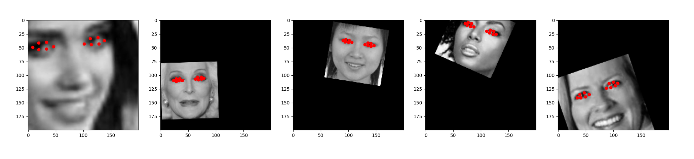

# Eye tracking using Tensorflow #

Eye tracking using the UTK and 300W datasets. This example uses only the eye landmarks and not the full landmark set around the face. 

The data was first sanitized to remove some images that were outside my use case. For example, multiple people in the image or in some cases the landmarks were just incorrect.

A number of examples online using the UTK dataset suffer generalization issues. The dataset is very curated. To attempt improve upon this I augmented the images which produced ok results. I then added in augmentation per epoch which adds a lot of overhead but produced better results. The final step was to add the 300W dataset which contains whole body images vs UTKs face only images.

The final results I was happy with but there's still a lot of room for improvement. More data/augmentations are needed. Another improvement would be to blur the image edges. The model began to learn the rotation of the squares which was noticeable if a square was rotated ~30deg but the face was centered.

The code is a bit of a mess and the model is large so this shouldn't be taken as a good example.

### Environment ###
* WSL

### Commands ###
* Docker is used to run tensorflow

```docker run --gpus all -it --rm -v <folder_dir>:/tmp tensorflow/tensorflow:latest-gpu bash```

```pip install pandas scikit-learn matplotlib albumentations```

* Open another terminal and run Tensorboard

```docker run -p 8888:8888 -p 6006:6006 -v <folder_dir>:/logdir --gpus all -it --rm tensorflow/tensorflow:latest-gpu bash```

```tensorboard --logdir /logdir --bind_all```

### Result ###



### References ###
* https://ibug.doc.ic.ac.uk/resources/300-W/
* https://susanqq.github.io/UTKFace/
